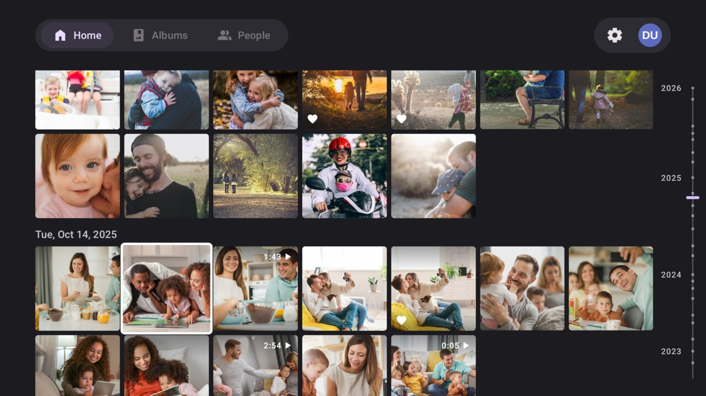
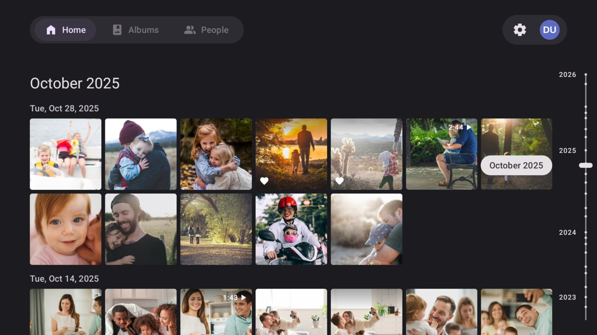
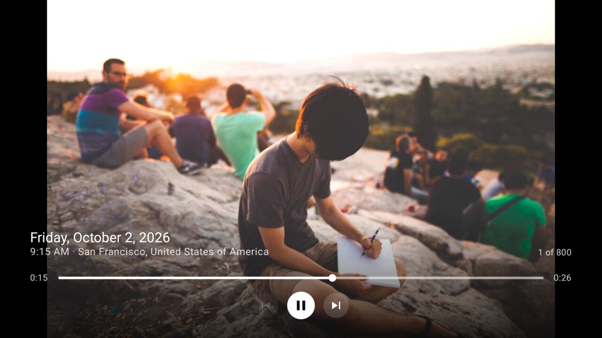
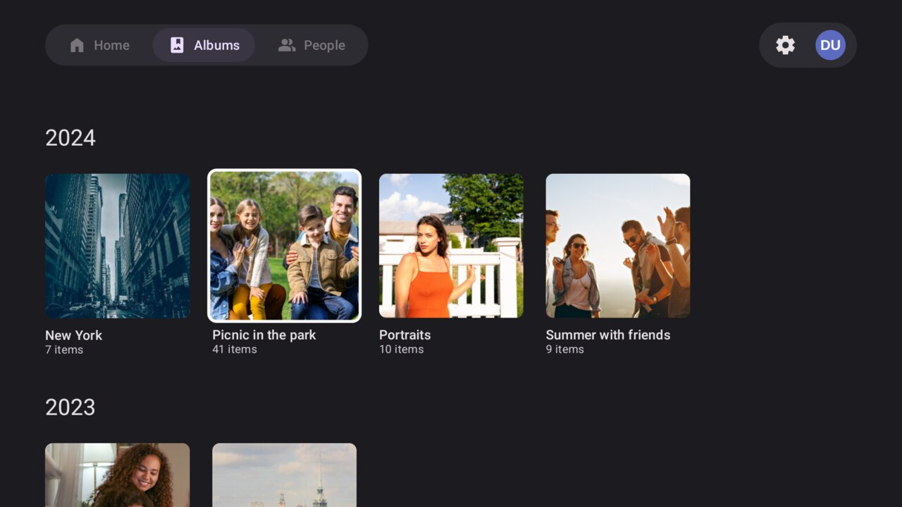
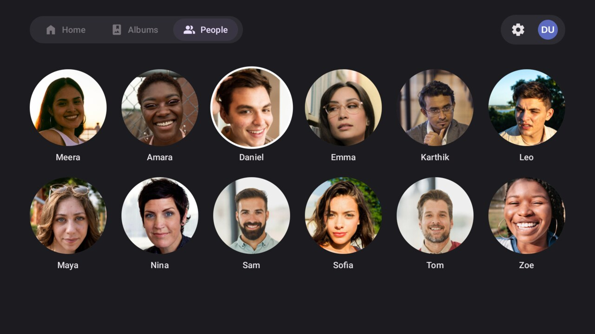
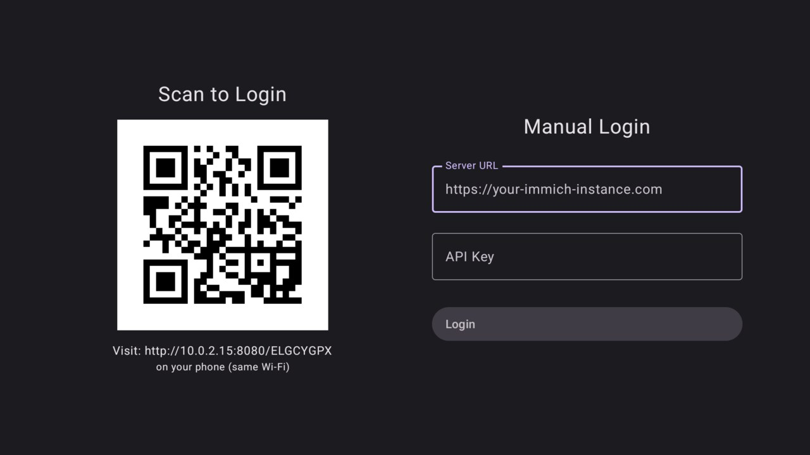

# ImmichTV

An Android TV app for browsing your [Immich](https://immich.app) photo library from the couch.
Built for the remote: everything works with a D-pad, and the timeline stays smooth on modest TV
hardware.

[](LICENSE)


> ImmichTV is an unofficial, community-made client. It is not affiliated with or endorsed by the
> Immich project. It only reads from your server: it never uploads, edits or deletes anything.



<table>
  <tr>
    <td width="50%"><br><sub>Jump through months and years with the scrubber</sub></td>
    <td width="50%"><br><sub>Full-screen viewer with the date and place</sub></td>
  </tr>
  <tr>
    <td><br><sub>Video playback</sub></td>
    <td><br><sub>Albums, grouped by year</sub></td>
  </tr>
  <tr>
    <td><br><sub>People</sub></td>
    <td><br><sub>Log in from your phone with a QR code</sub></td>
  </tr>
</table>

<sub>Screenshots are of the app running against the <a href="tools/mock-immich-server">mock server</a>, showing
CC0 photos from <a href="https://stocksnap.io">StockSnap</a>.</sub>

## Features

- **Timeline** – your whole library, newest first, grouped by day, including partner-shared
  photos and stack covers, just like the Photos tab in the Immich apps.
- **Timeline scrubber** – a rail on the right with a label per year. Step through months with Up
  and Down and jump years into the past in a couple of presses.
- **Full-screen viewer** – flick through photos with Left and Right. The date, time and place of
  each one fade in and out of the way.
- **Video playback** – plays the copy Immich transcoded for streaming, with seeking, play/pause,
  and support for the remote's media keys.
- **Albums** – your own albums and ones shared with you, grouped by year, each opening to its own
  timeline in the order chosen for it in Immich.
- **People** – everyone you've named in Immich, favorites first, each with a page of their photos.
- **Log in from your phone** – scan a QR code on the TV and paste your server address and API key
  on your phone instead of typing them with a remote.
- **Instant placeholders** – tiles show Immich's ThumbHash blur until the real thumbnail arrives.
- **Light and dark themes**, or follow the system.

## Requirements

- An Android TV or Google TV device running **Android 9 (API 28) or later**.
- An **Immich server** the TV can reach. The app targets the Immich v3 API and falls back
  gracefully on older servers where the API differed (video durations, album listing, people
  paging).
- An **Immich API key** (see below).

## Install

There are no prebuilt releases yet, so for now you build the APK yourself and sideload it.

```sh
git clone https://github.com/gondhijagapathi/ImmichTV.git
cd ImmichTV
./gradlew assembleDebug
```

The APK is written to `app/build/outputs/apk/debug/app-debug.apk`. With
[ADB debugging enabled](https://developer.android.com/training/tv/get-started/hardware#usb-debugging)
on the TV:

```sh
adb connect <tv-ip-address>
adb install app/build/outputs/apk/debug/app-debug.apk
```

Or run `./gradlew installDebug` to build and install in one step.

## Logging in

ImmichTV signs in with an API key rather than your password.

1. In the Immich web app, open **Account Settings → API Keys** and create a key. A key with all
   permissions works, but since the app only reads, you can limit it to the
   [permissions it needs](#api-key-permissions).
2. Open ImmichTV. Then either:
   - **Scan the QR code** with your phone (on the same Wi-Fi or LAN as the TV), enter the server
     URL and API key on the page that opens, and tap **Login to TV**; or
   - **Type them on the TV** under Manual Login.

The server URL must include the scheme, e.g. `https://photos.example.com` or
`http://192.168.1.10:2283`.

To sign out, select your profile picture in the top right.

### API key permissions

| Permission | Used for |
|---|---|
| `user.read` | Checking the key when you log in, and your name |
| `userProfileImage.read` | Your profile picture in the top bar |
| `asset.read` | The timeline: which photos and videos exist, and when they were taken |
| `asset.view` | Thumbnails, full-screen photos and video playback |
| `album.read` | The Albums tab and album pages |
| `person.read` | The People tab, person pages and their face thumbnails |
| `person.statistics` | The number of photos on a person's page |

If the key is missing one of these, the screen that needs it shows an error, or its pictures don't
load.

## Remote controls

| Where | Key | What it does |
|---|---|---|
| Timeline | D-pad | Move between photos |
| | OK | Open the photo or video |
| | Right, past the last column | Focus the timeline scrubber |
| | Back | Jump back to the newest photos |
| Scrubber | Up / Down | Step through months; the grid follows |
| | OK or Left | Go to the chosen month |
| Photo | Left / Right | Previous / next |
| | OK, Up or Down | Show or hide the details |
| Video | Left / Right | Seek 10 seconds back / forward |
| | OK | Play or pause |
| | Up | Show or hide the details |
| | Down | Move to the on-screen controls (previous, play/pause, next) |
| | Media keys | Play, pause, rewind, fast-forward, previous, next |
| Albums, People | Back | Return to Home |

## Privacy and security

- The app talks **only to your Immich server**. There are no analytics, ads or third-party
  services.
- Your server URL and API key are stored encrypted with AES-256-GCM, using a key held in the
  Android Keystore that can't leave the device. They're excluded from cloud backups and device
  transfers.
- Phone login is served by the TV itself on your local network. The page is only reachable under
  a one-time pairing code embedded in the QR code, which is replaced after a successful login or
  ten wrong guesses. The page is plain HTTP, so the API key crosses your LAN unencrypted on its
  way from the phone to the TV; use manual login on networks you don't trust.
- Plain `http://` servers are allowed, since many home servers are LAN-only, and certificate
  authorities you've installed on the TV are trusted, so self-signed setups work. Prefer `https://`
  whenever the server is reached over the internet.

## Development

### Prerequisites

- Android Studio (a recent version with Android Gradle Plugin 9 support), or just the Android SDK
  with platform 37.
- No separate JDK setup: Gradle downloads the toolchain it needs.

### Build and test

```sh
./gradlew assembleDebug        # build the debug APK
./gradlew installDebug         # build and install on a connected TV or emulator
./gradlew testDebugUnitTest    # run the unit tests
```

### Trying it without an Immich server

[`tools/mock-immich-server`](tools/mock-immich-server) is a stand-in server that makes up a
library of photos, videos, albums and people and serves it through the parts of the Immich API the
app uses. Every image is stamped with its date and number, which makes ordering and grouping easy
to check.

```sh
python3 tools/mock-immich-server/mock_immich_server.py
```

Then log in with `http://10.0.2.2:2283` from the Android TV emulator (or
`http://<your computer's IP>:2283` from a real TV) and the API key `test-api-key`. See its
[README](tools/mock-immich-server/README.md) for options such as library size, slow responses and
emulating older Immich versions.

For screenshots and demos it can show real photos instead, with `--photos <folder>`. The
screenshots above were taken that way; the same README explains how to get the photos they use.

### Project layout

```
app/src/main/java/com/jagapathi/immichtv/
├── data/         Encrypted settings storage (DataStore + Android Keystore)
├── di/           Hilt modules: HTTP clients, image loader, video player
├── model/        Immich API response types
├── network/      Immich API client and the phone-login web server
├── ui/
│   ├── auth/       Login screen
│   ├── main/       Tabs and top navigation bar
│   ├── timeline/   Photo grid, scrubber, full-screen viewer, video controls
│   ├── albums/     Albums tab and album pages
│   ├── people/     People tab and person pages
│   ├── settings/   Settings
│   └── components/ Shared TV focus and scrolling helpers
└── util/         ThumbHash decoding, QR codes, network monitoring
tools/
├── mock-immich-server/   Fake Immich server for development and screenshots
└── app-art/              Generates the launcher icon and TV banner from Immich's logo
```

### Built with

[Jetpack Compose](https://developer.android.com/compose) and
[Compose for TV](https://developer.android.com/training/tv/playback/compose) ·
[Media3 ExoPlayer](https://developer.android.com/media/media3) ·
[Coil](https://coil-kt.github.io/coil/) ·
[Ktor](https://ktor.io) ·
[Hilt](https://dagger.dev/hilt/) ·
[DataStore](https://developer.android.com/topic/libraries/architecture/datastore) ·
[kotlinx.serialization](https://github.com/Kotlin/kotlinx.serialization) ·
[ZXing](https://github.com/zxing/zxing)

## Contributing

Bug reports, ideas and pull requests are welcome.

- **Found a bug?** [Open an issue](https://github.com/gondhijagapathi/ImmichTV/issues) with your
  TV model, Android version, Immich server version, and what you did and saw.
- **Sending a pull request?** Keep it to one change, add or update unit tests where the logic can
  be tested off-device, and make sure `./gradlew testDebugUnitTest` passes. Please try the change
  with a real remote or the emulator's D-pad: focus and scrolling behave very differently from
  touch.
- For anything large, open an issue first so we can agree on the approach.

## Acknowledgements

- [Immich](https://github.com/immich-app/immich), the self-hosted photo and video platform this
  app is a client for. The launcher icon and TV banner are derived from Immich's logo.
- [ThumbHash](https://evanw.github.io/thumbhash/) by Evan Wallace. The placeholder decoder is
  ported from its MIT-licensed reference implementation.
- [StockSnap](https://stocksnap.io) and its photographers, for the CC0 photos in the screenshots.

## License

[MIT](LICENSE) © Jagapathi Gondi
